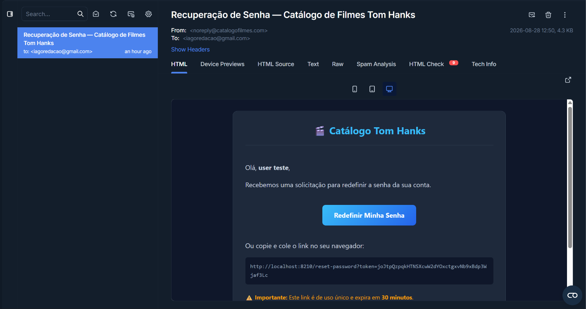

# 🎬 Catálogo de Filmes — Tom Hanks (Arquitetura de Microsserviços)

Aplicação web desenvolvida em arquitetura de microsserviços com Python (FastAPI) e Docker. Permite explorar a filmografia de Tom Hanks ao vivo da API TMDB, favoritar filmes, comentar, controlar papéis de acesso e redefinir senhas com envio de e-mails via Mailtrap.

professor: @siriani

---

## 🏛️ Arquitetura de Microsserviços

A aplicação foi decomposta em dois serviços independentes interconectados via rede privada Docker:

```
                  [ Navegador / Usuário ]
                             │
                             ▼ Porta pública (${APP_PORT:-8000})
                    ┌─────────────────┐
                    │ catalog-service │ ◄── (Ponto público: UI + TMDB + Favoritos)
                    └────────┬────────┘
                             │  Rede interna Docker (internal-net)
                             ▼  HTTP interno: http://auth-service:8001
                    ┌─────────────────┐
                    │  auth-service   │ ◄── (Serviço privado: Autenticação + SMTP)
                    └────────┬────────┘
                             │
             ┌───────────────┴───────────────┐
             ▼                               ▼
       [ MariaDB ]                  [ Mailtrap SMTP ]
(Usuários, Reset Tokens,       (E-mails de recuperação
 Favoritos, Comentários)            de senha)
```

1. **`catalog-service` (Público)**:
   - Único ponto de entrada exposto ao usuário.
   - Serve as páginas SSR (Jinja2) e arquivos estáticos.
   - Consome a API do TMDB em tempo real para catálogo de filmes.
   - Gerencia a persistência de favoritos e comentários com segregação estrita por `usuario_id` no MariaDB.
   - Repassa todas as requisições de login, registro e recuperação para o `auth-service`.

2. **`auth-service` (Privado)**:
   - Totalmente isolado (sem portas externas mapeadas).
   - Gerencia cadastro, controle de papéis (`user` / `admin`) e login com hash `bcrypt` e JWT.
   - Fluxo de **Esqueci minha senha**: geração de tokens seguros de 30 minutos em `reset_tokens`.
   - Disparo real de e-mails formatados em HTML via SMTP Mailtrap.
   - Validação rígida de tokens (existência, validade temporal e ineditismo de uso).

---

## 🚀 Funcionalidades

- 🔐 **Autenticação Desacoplada**: Registro, login e emissão de tokens JWT com identificação de papéis (`role: user | admin`).
- 🔑 **Recuperação de Senha Segura**: Disparo de e-mail via SMTP (Mailtrap) com link e token criptográfico de uso único com expiração em 30 minutos.
- 🎞️ **Catálogo TMDB ao Vivo**: Busca de filmes em tempo real na API TMDB (sem salvar o catálogo desnecessariamente no banco).
- ⭐ **Favoritos & Comentários**: Dados segregados e protegidos contra IDOR gravados no MariaDB individual.
- 🛡️ **Segurança Total**: Nenhuma credencial ou chave hardcoded no código; injeção estrita via variáveis de ambiente.

---

## 🛠️ Stack Tecnológica

| Camada            | Tecnologia                          |
|-------------------|-------------------------------------|
| Gateway / UI      | FastAPI + Jinja2 (catalog-service)  |
| Autenticação      | FastAPI + Jose JWT + Passlib bcrypt |
| Envio de E-mails  | Python SMTP (Mailtrap)              |
| Banco de Dados    | MariaDB                             |
| API Externa       | TMDB (The Movie Database)           |
| Comunicação HTTP  | httpx (assíncrono)                  |
| Orquestração      | Docker Compose (Bridge Network)     |

---

## ⚙️ Como Rodar Localmente

### 1. Clonar o repositório
```bash
git clone <url-do-repo>
cd atividade2
```

### 2. Configurar as variáveis de ambiente
Copie o arquivo de exemplo e preencha com suas credenciais:
```bash
cp .env.example .env
```

### 3. Subir os microsserviços com Docker Compose
```bash
docker-compose up --build
```

Acesse no navegador:
`http://localhost:8000` (ou na porta configurada em `APP_PORT`).

---

## 🔐 Variáveis de Ambiente (`.env`)

| Variável            | Descrição                                         | Padrão / Exemplo |
|---------------------|---------------------------------------------------|-------------------|
| `TMDB_API_KEY`      | Chave de desenvolvedor da API TMDB               | `e022dc5...`      |
| `DB_HOST`           | Endereço do host do MariaDB                       | `35.226.64.52`    |
| `DB_PORT`           | Porta do MariaDB                                  | `3306`            |
| `DB_USER`           | Usuário de acesso ao banco                        | `meu_usuario`     |
| `DB_PASSWORD`       | Senha de acesso ao banco                          | `minha_senha`     |
| `DB_NAME`           | Nome da base de dados                             | `minha_base`      |
| `SECRET_KEY`        | Segredo para assinatura dos tokens JWT            | `secret-key-32`   |
| `AUTH_SERVICE_URL`  | URL interna do serviço de auth                    | `http://auth-service:8001` |
| `SMTP_HOST`         | Host SMTP do Mailtrap                             | `sandbox.smtp.mailtrap.io` |
| `SMTP_PORT`         | Porta SMTP                                        | `2525`            |
| `SMTP_USER`         | Usuário SMTP Mailtrap                             |                   |
| `SMTP_PASSWORD`     | Senha SMTP Mailtrap                               |                   |
| `SMTP_FROM`         | E-mail remetente de notificações                  | `noreply@catalogofilmes.com` |
| `APP_PORT`          | Porta pública mapeada no container                | `8000`            |

---

## 📁 Estrutura do Projeto

```
├── app/                        # catalog-service (Público)
│   ├── main.py                 # Rotas da UI, catálogo e repasse HTTP
│   ├── auth.py                 # Cliente HTTP assíncrono para o auth-service
│   ├── tmdb.py                 # Consumo da API TMDB
│   ├── database.py             # Conexão e init de favoritos/comentários
│   ├── templates/              # Telas Jinja2 (login, register, forgot/reset, catalog)
│   └── static/                 # Estilos e design system (CSS)
│
├── auth_service/               # auth-service (Privado)
│   ├── main.py                 # Endpoints privados de auth e reset de senha
│   ├── models.py               # Schemas Pydantic de validação
│   ├── security.py             # Hash bcrypt, JWT e geração de tokens
│   ├── mailer.py               # Disparo real de e-mails via Mailtrap SMTP
│   └── database.py             # Conexão e garantia de schema (usuarios, reset_tokens)
│
├── schema.sql                  # Script SQL do banco de dados
├── Dockerfile                  # Imagem base dos microsserviços
├── docker-compose.yml          # Orquestração com rede internal-net
├── requirements.txt            # Dependências Python
├── .env.example                # Modelo de variáveis de ambiente
└── README.md                   # Documentação do projeto
```

## ✉️ Imagem do mailtrap recebendo e-mail


## ✉️ imagem do sistema ao tentar acessar o link de recuperação de senha após 30 minutos ou após já ter utilizado
