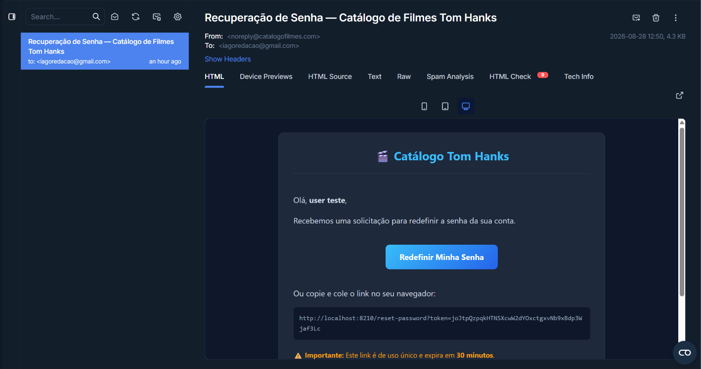
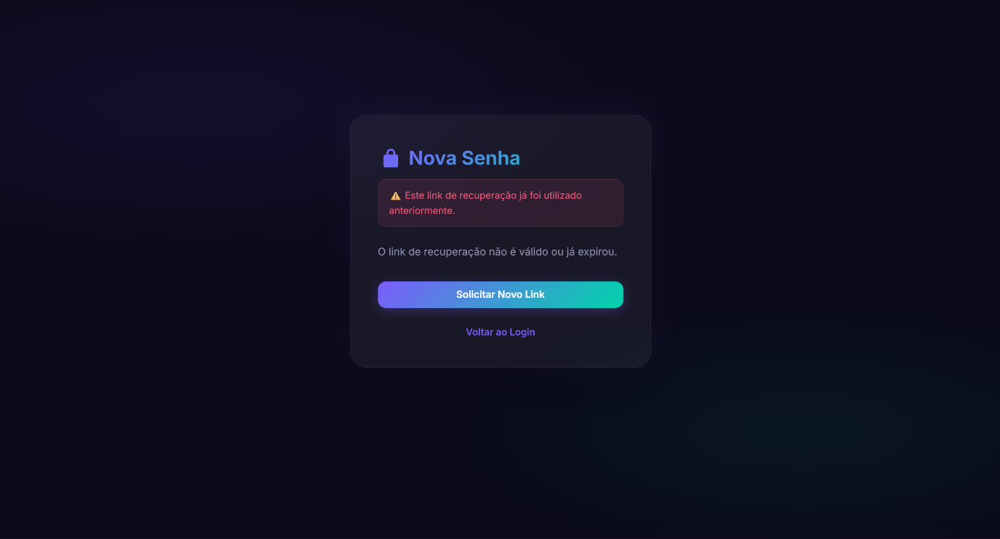

# 🎬 Catálogo de Filmes — Tom Hanks (Arquitetura de Microsserviços)

Aplicação web desenvolvida em arquitetura de microsserviços com Python (FastAPI) e Docker. Permite explorar a filmografia de Tom Hanks ao vivo da API TMDB, favoritar filmes, comentar, controlar papéis de acesso, redefinir senhas com envio de e-mails via Mailtrap, registrar logs de auditoria centralizados com Redis Streams, e gerenciar um **perfil de usuário com foto e biografia** armazenadas no **MinIO** (Object Storage).

**Professor:** [@siriani](https://github.com/siriani)

---

## 🏛️ Arquitetura de Microsserviços

A aplicação foi decomposta em três serviços independentes interconectados via rede privada Docker, mais um Redis para persistência de eventos:

```
                  [ Navegador / Usuário ]
                             │
                             ▼ Porta pública (${APP_PORT:-8000})
                    ┌─────────────────┐
                    │ catalog-service │ ◄── (Ponto público: UI + TMDB + Favoritos)
                    └────────┬────────┘
                             │  Rede interna Docker (internal-net)
                 ┌───────────┼───────────────────────────┐
                 ▼           ▼                           ▼
        ┌─────────────┐  ┌─────────────┐        ┌─────────────┐
        │ auth-service│  │ log-service │        │    Redis    │
        │ (Privado)   │  │ (Privado)   │──────► │  (Streams)  │
        └──────┬──────┘  └─────────────┘        └─────────────┘
               │              ▲
       ┌───────┴──────┐       │ Eventos de auditoria
       ▼              ▼       │ (login, logout, favoritar,
  [ MariaDB ]   [ Mailtrap ]  │  comentar, moderar, 403)
```

### Serviços

1. **`catalog-service` (Público)** — Porta `8000`:
   - Único ponto de entrada exposto ao usuário.
   - Serve as páginas SSR (Jinja2) e arquivos estáticos.
   - Consome a API do TMDB em tempo real para catálogo de filmes.
   - Gerencia a persistência de favoritos e comentários com segregação estrita por `usuario_id` no MariaDB.
   - Repassa todas as requisições de login, registro e recuperação para o `auth-service`.
   - **Dispara eventos de auditoria** para o `log-service` a cada ação relevante.
   - **Expõe a rota `/admin/logs`** para consulta de logs (somente admin), repassando a chamada ao `log-service`.

2. **`auth-service` (Privado)** — Porta `8001` (somente interna):
   - Totalmente isolado (sem portas externas mapeadas).
   - Gerencia cadastro, controle de papéis (`user` / `admin`) e login com hash `bcrypt` e JWT.
   - Fluxo de **Esqueci minha senha**: geração de tokens seguros de 30 minutos em `reset_tokens`.
   - Disparo real de e-mails formatados em HTML via SMTP Mailtrap.
   - **Dispara evento de auditoria `login`** para o `log-service` após autenticação bem-sucedida.

3. **`log-service` (Privado)** — Porta `8002` (somente interna):
   - Microsserviço de auditoria centralizada.
   - Recebe eventos via `POST /logs` de qualquer serviço e persiste no **Redis Stream** via `XADD`.
   - Expõe `GET /logs` para consulta protegida por RBAC (somente admin, via JWT).
   - `GET /health` para verificação de saúde.

4. **`Redis`** — Porta `6379` (somente interna):
   - Armazena eventos de auditoria em **Redis Streams** (`XADD`/`XREVRANGE`).
   - Volume persistente (`redis-data`) para manter dados entre restarts.

5. **`MinIO`** — Porta `9000` API (somente interna) / `9001` Console (pública opção):
   - Object Storage compatível com S3 para armazenamento de fotos de perfil (avatares).
   - O `catalog-service` é o único que escreve no bucket. As credenciais ficam apenas no servidor.
   - O MinIO **não exposta a porta 9000 no host**. O `catalog-service` serve as imagens via proxy em `/storage/avatars/<filename>`.
   - Volume persistente (`minio-data`) para manter as fotos entre restarts.

### Fluxo de Eventos de Auditoria

Toda ação relevante do sistema gera um evento HTTP `POST` para o `log-service`:

| Evento | Disparado por | Descrição |
|--------|:---:|------------|
| `login` | `catalog-service` e `auth-service` | Autenticação bem-sucedida |
| `logout` | `catalog-service` | Encerramento de sessão |
| `favoritar` | `catalog-service` | Usuário favorita um filme |
| `comentar` | `catalog-service` | Usuário adiciona comentário |
| `remover_comentario_admin` | `catalog-service` | Admin remove comentário de outro usuário (moderação) |
| `remover_comentario_proprio` | `catalog-service` | Usuário remove próprio comentário |
| `perfil.atualizado` | `catalog-service` | Usuário atualizou bio e/ou foto de perfil |
| `acesso_negado_403` | `catalog-service` | Tentativa de ação sem permissão (inclui editar perfil alheio) |
| `audit.security.access_denied` | `catalog-service` | Tentativa específica de editar o perfil de outro usuário |

**Importante:** O envio de logs é "best-effort" — falhas no `log-service` são tratadas com `try/except` silencioso e não derrubam a ação principal do usuário.

### Por que Redis Streams (e não lista simples)?

Optamos por **Redis Streams** (`XADD`/`XREVRANGE`) em vez de listas simples (`LPUSH`/`LRANGE`) porque:
- Streams geram IDs com timestamp nativo (`<millis>-<seq>`), garantindo ordenação cronológica automática.
- `XREVRANGE` permite consultar "últimos N eventos" de forma eficiente sem reverter a lista inteira.
- É a estrutura de dados do Redis projetada especificamente para log de eventos.

---

## 🚀 Funcionalidades

- 🔐 **Autenticação Desacoplada**: Registro, login e emissão de tokens JWT com identificação de papéis (`role: user | admin`).
- 🔑 **Recuperação de Senha Segura**: Disparo de e-mail via SMTP (Mailtrap) com link e token criptográfico de uso único com expiração em 30 minutos.
- 🎞️ **Catálogo TMDB ao Vivo**: Busca de filmes em tempo real na API TMDB (sem salvar o catálogo desnecessariamente no banco).
- ⭐ **Favoritos & Comentários**: Dados segregados e protegidos contra IDOR gravados no MariaDB individual.
- 👤 **Perfil de Usuário (Atividade 6)**: Página de perfil estilo rede social com foto de avatar e biografia. A foto é armazenada no **MinIO** (Object Storage); o banco guarda apenas a chave do objeto.
- 🛡️ **Segurança Total**: Nenhuma credencial ou chave hardcoded no código; injeção estrita via variáveis de ambiente.
- 🔒 **Autorização RBAC**: Controle de acesso baseado em papéis (`user` / `admin`) com enforcement no backend.
- 📋 **Logs de Auditoria Centralizado**: Microsserviço dedicado com Redis Streams para registro imutável de "quem fez o quê, e quando".

---

## 🔒 Autorização — RBAC (Role-Based Access Control)

O sistema implementa controle de acesso baseado em papéis. O campo `role` na tabela `usuarios` define as permissões de cada conta.

### Permissões por Papel

| Ação | `user` (usuário comum) | `admin` (administrador) |
|------|:---:|:---:|
| Visualizar catálogo de filmes | ✅ | ✅ |
| Favoritar / Desfavoritar filmes | ✅ | ✅ |
| Adicionar comentários | ✅ | ✅ |
| Apagar **próprios** comentários | ✅ | ✅ |
| Apagar comentários **de outros usuários** (Moderação) | ❌ (HTTP 403) | ✅ |
| Visualizar comentários de outros usuários | ❌ | ✅ |
| Consultar logs de auditoria (`/admin/logs`) | ❌ (HTTP 403) | ✅ |

### Padrão de Arquitetura: Padrão A — Enforcement Centralizado

Neste projeto utilizamos o **Padrão A (Enforcement Centralizado no Gateway)**. O fluxo funciona assim:

1. O usuário faz login e recebe um **token JWT** (emitido pelo `auth-service`).
2. A cada requisição protegida, o `catalog-service` envia o token para o endpoint `/auth/verify` do `auth-service`.
3. O `auth-service` decodifica o JWT, consulta o banco de dados e retorna os dados do usuário **incluindo o `role`**.
4. O `catalog-service` recebe o `role` e **decide localmente** se autoriza ou nega a ação (ex: retornar `HTTP 403 Forbidden`).

**Vantagem:** A fonte de verdade do papel do usuário é sempre o banco de dados. Se um admin for rebaixado para `user`, a mudança é instantânea — na próxima requisição ele já perde os privilégios.

### O que mudaria com o Padrão B — Claims no JWT?

No **Padrão B**, o `role` seria incluído diretamente dentro do payload (claims) do token JWT no momento da emissão. O `catalog-service` decodificaria o token **localmente** (sem consultar o `auth-service` a cada requisição) e leria o `role` direto do JWT.

**Mudanças no código:**
- O `auth-service` incluiria `"role": "admin"` no payload do JWT durante o login.
- O `catalog-service` não precisaria mais chamar `/auth/verify`. Bastaria decodificar o JWT localmente com a `SECRET_KEY` compartilhada.
- A função `verify_token()` em `app/auth.py` seria substituída por uma decodificação local usando `python-jose`.

**Trade-off:** Maior performance (sem chamada HTTP a cada request), porém o `role` fica "congelado" no token até ele expirar. Se um admin for rebaixado, ele mantém os privilégios até o JWT expirar ou ser invalidado manualmente.

**Nota:** O `log-service` utiliza o **Padrão B** para decodificar o JWT localmente na rota `GET /logs`, pois não precisa consultar o banco — apenas verifica se o token é válido e se o `role` é `admin`. Essa é uma decisão arquitetural consciente: para um serviço interno de leitura de logs, a verificação local é suficiente e mais performática.

---

## 🛠️ Stack Tecnológica

| Camada            | Tecnologia                          |
|-------------------|-------------------------------------|
| Gateway / UI      | FastAPI + Jinja2 (catalog-service)  |
| Autenticação      | FastAPI + Jose JWT + Passlib bcrypt |
| Logs / Auditoria  | FastAPI + Redis Streams (log-service) |
| Envio de E-mails  | Python SMTP (Mailtrap)              |
| Object Storage    | MinIO (compatível com S3)           |
| Banco de Dados    | MariaDB                             |
| Cache de Eventos  | Redis 7 Alpine                      |
| API Externa       | TMDB (The Movie Database)           |
| Comunicação HTTP  | httpx (assíncrono)                  |
| Orquestração      | Docker Compose (Bridge Network)     |

---

## ⚙️ Como Rodar Localmente

### 1. Clonar o repositório
```bash
git clone <url-do-repo>
cd atividade2
```

### 2. Configurar as variáveis de ambiente
Copie o arquivo de exemplo e preencha com suas credenciais:
```bash
cp .env.example .env
```

### 3. Subir os microsserviços com Docker Compose
```bash
docker-compose up --build
```

Acesse no navegador:
`http://localhost:8000` (ou na porta configurada em `APP_PORT`).

---

## 🔐 Variáveis de Ambiente (`.env`)

| Variável            | Descrição                                         | Padrão / Exemplo |
|---------------------|---------------------------------------------------|-------------------|
| `TMDB_API_KEY`      | Chave de desenvolvedor da API TMDB               | `e022dc5...`      |
| `DB_HOST`           | Endereço do host do MariaDB                       | `35.226.64.52`    |
| `DB_PORT`           | Porta do MariaDB                                  | `3306`            |
| `DB_USER`           | Usuário de acesso ao banco                        | `meu_usuario`     |
| `DB_PASSWORD`       | Senha de acesso ao banco                          | `minha_senha`     |
| `DB_NAME`           | Nome da base de dados                             | `minha_base`      |
| `SECRET_KEY`        | Segredo para assinatura dos tokens JWT            | `secret-key-32`   |
| `AUTH_SERVICE_URL`  | URL interna do serviço de auth                    | `http://auth-service:8001` |
| `LOG_SERVICE_URL`   | URL interna do serviço de logs                    | `http://log-service:8002` |
| `REDIS_HOST`        | Host do Redis (usado pelo log-service)            | `redis`           |
| `REDIS_PORT`        | Porta do Redis                                    | `6379`            |
| `SMTP_HOST`         | Host SMTP do Mailtrap                             | `sandbox.smtp.mailtrap.io` |
| `SMTP_PORT`         | Porta SMTP                                        | `2525`            |
| `SMTP_USER`         | Usuário SMTP Mailtrap                             |                   |
| `SMTP_PASSWORD`     | Senha SMTP Mailtrap                               |                   |
| `SMTP_FROM`         | E-mail remetente de notificações                  | `noreply@catalogofilmes.com` |
| `APP_PORT`          | Porta pública mapeada no container                | `8000`            |
| `MINIO_ENDPOINT`    | Endpoint interno do MinIO                         | `minio:9000`      |
| `MINIO_ROOT_USER`   | Usuário admin do MinIO (**obrigatório**, mín. 3 chars) | `minioadmin`   |
| `MINIO_ROOT_PASSWORD` | Senha admin do MinIO (**obrigatório**, mín. 8 chars) | `minioadmin`  |
| `MINIO_BUCKET`      | Nome do bucket para avatares                      | `avatars`         |
| `MINIO_CONSOLE_PORT`| Porta pública do console web do MinIO             | `9001`            |

---

## 📁 Estrutura do Projeto

```
├── app/                        # catalog-service (Público)
│   ├── main.py                 # Rotas da UI, catálogo, perfil, repasse HTTP e disparo de logs
│   ├── auth.py                 # Cliente HTTP assíncrono para o auth-service
│   ├── tmdb.py                 # Consumo da API TMDB
│   ├── database.py             # Conexão e init de tabelas (inclui migração bio/avatar_key)
│   ├── minio_client.py         # Cliente MinIO: bucket, upload, remoção e proxy de avatares
│   ├── templates/              # Telas Jinja2 (login, register, catalog, profile, admin_logs)
│   └── static/                 # Estilos e design system (CSS)
│
├── auth_service/               # auth-service (Privado)
│   ├── main.py                 # Endpoints privados de auth, reset de senha e disparo de logs
│   ├── models.py               # Schemas Pydantic de validação
│   ├── security.py             # Hash bcrypt, JWT e geração de tokens
│   ├── mailer.py               # Disparo real de e-mails via Mailtrap SMTP
│   └── database.py             # Conexão e garantia de schema (usuarios, reset_tokens)
│
├── log_service/                # log-service (Privado) — Atividade 5
│   ├── __init__.py             # Pacote Python
│   └── main.py                 # Endpoints de log: POST /logs, GET /logs, GET /health
│
├── schema.sql                  # Script SQL do banco de dados (incl. bio e avatar_key)
├── Dockerfile                  # Imagem base dos microsserviços
├── docker-compose.yml          # Orquestração com rede internal-net (incl. redis + log-service + minio)
├── requirements.txt            # Dependências Python (incl. redis, minio)
├── .env.example                # Modelo de variáveis de ambiente
└── README.md                   # Documentação do projeto
```

## ✉️ Imagem do mailtrap recebendo e-mail


## ✉️ imagem do sistema ao tentar acessar o link de recuperação de senha após 30 minutos ou após já ter utilizado


---

## 🗄️ Object Storage (MinIO) — Atividade 6

### Decisão do Modelo de Acesso ao Bucket

Foi adotada a **Opção A — Bucket com leitura pública** (`s3:GetObject` para todos).

#### Trade-offs

| Critério | Opção A (Pública) | Opção B (URLs pré-assinadas) |
|----------|:---:|:---:|
| Complexidade | Baixa | Alta |
| URLs permanentes | ✅ | ❌ (expiram) |
| Controle de acesso | Baixo (qualquer um com a URL acessa) | Alto |
| Caching no browser | ✅ Simples | Complexo (URL muda) |
| Revogação de acesso | Só deletando o objeto | Basta não gerar nova URL |

**Justificativa da escolha:** As fotos de perfil são informações intencionalmente pública (mesma lógica de um avatar em rede social). A simplicidade da Opção A não exige gerar/renovar URLs em cada requisição, o que reduz latência e complexidade. O risco (“qualquer pessoa com a URL exata pode ver a foto”) é aceitável dado o contexto acadêmico e o tipo de dado.

> Caso o requisito mude para fotos privadas, a Opção B pode ser implementada gerando URLs pré-assinadas com `client.presigned_get_object(bucket, key, expires=timedelta(hours=1))` e ajustando a rota `/storage/avatars/<filename>` para redirecionar para a URL temporária.

### Fluxo de Upload

```
Navegador ──POST /profile/{id}/upload──► catalog-service
                                           │ 1. Valida JWT + ID (403 se diferente)
                                           │ 2. Valida MIME type e tamanho (≤ 3 MB)
                                           │ 3. Envia binário ────────────► MinIO (bucket: avatars)
                                           │ 4. Grava bio + avatar_key ──► MariaDB
                                           │ 5. Remove foto anterior do MinIO (best-effort)
Navegador ──GET /storage/avatars/{file}──► catalog-service ─lê do─► MinIO
```

### Segurança

- O `PUT` compara o `id` da URL com o `user_id` extraído do JWT. Se forem diferentes, responde **HTTP 403** e registra o evento `audit.security.access_denied`.
- O backend **nunca confia** no `user_id` enviado no corpo da requisição.
- Credenciais MinIO (`MINIO_ROOT_USER` / `MINIO_ROOT_PASSWORD`) ficam apenas no servidor.
- Leitura pública cobre apenas `s3:GetObject`. Escrita é exclusiva do backend.
- Ao trocar de foto, a anterior é removida do bucket para evitar objetos órfãos.